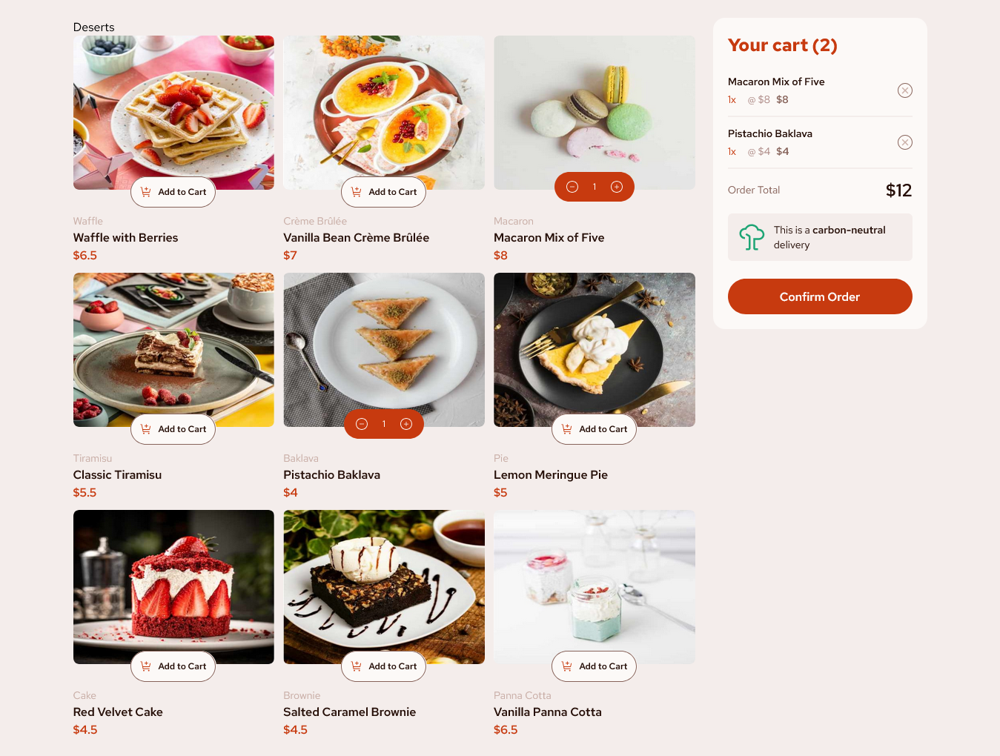

# Frontend Mentor - Product list with cart solution

This is a solution to the [Product list with cart challenge on Frontend Mentor](https://www.frontendmentor.io/challenges/product-list-with-cart-5MmqLVAp_d). Frontend Mentor challenges help you improve your coding skills by building realistic projects.

## Table of contents

- [Overview](#overview)
  - [The challenge](#the-challenge)
  - [Screenshot](#screenshot)
  - [Links](#links)
  - [Built with](#built-with)
  - [What I learned](#what-i-learned)
- [Author](#author)

## Overview

### The challenge

Users should be able to:

- Add items to the cart and remove them
- Increase/decrease the number of items in the cart
- See an order confirmation modal when they click "Confirm Order"
- Reset their selections when they click "Start New Order"
- View the optimal layout for the interface depending on their device's screen size
- See hover and focus states for all interactive elements on the page

### Screenshot



### Links

- Solution URL: [github](https://github.com)

### Built with

- Semantic HTML5 markup
- Tailwind
- Flexbox
- CSS Grid
- Mobile-first workflow
- [React](https://reactjs.org/) - JS library
- [Typescript](https://www.typescriptlang.org/) - extends JavaScript by adding types to the language

### What I learned

Use this section to recap over some of your major learnings while working through this project. Writing these out and providing code samples of areas you want to highlight is a great way to reinforce your own knowledge.

To see how you can add code snippets, see below:

```js

// Types
type CartItem = {
  name: string;
  price: number;
  quantity: number;
  img : string
};

type CartState = {
  cart: CartItem[];
};

type Action =
  | { type: "ADDITEM"; product: Omit<CartItem, "quantity"> }
  | { type: "DELETEITEM"; name: string }
  | { type: "INCREMENT";name: string }
  | { type: "DECREMENT"; name: string }
  | { type: "CLEARCART"  };

type CartContextType = {
  cart: CartItem[];
  addItem: (product: Omit<CartItem, "quantity">) => void;
  deleteItem: (name: string) => void;
  increment: (name: string) => void;
  decrement: (name: string) => void;
  clearCart : ()=> void;
};

// Initial State
const initialCart: CartState = {
  cart: [],
};

// Reducer
function reducer(state: CartState, action: Action): CartState {
  switch (action.type) {
    case "ADDITEM": {
      const existingItem = state.cart.find(
        (item) => item.name === action.product.name
      );

      if (existingItem) {
        const updatedCart = state.cart.map((item) =>
          item.name === action.product.name
            ? { ...item, quantity: item.quantity + 1 }
            : item
        );
        return { ...state, cart: updatedCart };
      } else {
        const newItem = { ...action.product, quantity: 1 };
        return { ...state, cart: [...state.cart, newItem] };
      }
    }

    case "DELETEITEM": {
      const updatedCart = state.cart.filter((item) => item.name !== action.name);
      return { ...state, cart: updatedCart };
    }

    case "INCREMENT": {
      const updatedCart = state.cart.map((item) =>
        item.name === action.name ? { ...item, quantity: item.quantity + 1 } : item
      );
      return { ...state, cart: updatedCart };
    }

    case "DECREMENT": {
        const updatedCart = state.cart
          .map((item) => {
            if (item.name === action.name) {
              if (item.quantity === 1) {
                // Remove the item if quantity is 1
                return null; // Mark the item for removal
              } else {
                // Otherwise decrement the quantity
                return { ...item, quantity: item.quantity - 1 };
              }
            }
            return item;
          })
          .filter((item) => item !== null); // Remove the marked item (null) from the cart

        return { ...state, cart: updatedCart };
      }
      case "CLEARCART": {
        return { ...state, cart: [ ] }
      }


    default:
      throw new Error(`Unsupported action type: ${(action as Action).type}`);
  }
}

// Context
const CartContext = createContext<CartContextType | undefined>(undefined);

// Provider
export function CartContextProvider({ children }: { children: ReactNode }) {
  const [state, dispatch] = useReducer(reducer, initialCart);

  const addItem = (product: Omit<CartItem, "quantity">) => {
    dispatch({ type: "ADDITEM", product });
  };

  const deleteItem = (name: string) => {
    dispatch({ type: "DELETEITEM", name });
  };

  const increment = (name: string) => {
    dispatch({ type: "INCREMENT", name });
  };

  const decrement = (name: string) => {
    dispatch({ type: "DECREMENT", name });
  };

  const clearCart = ()=> {
    dispatch({type : 'CLEARCART'})
  }

  return (
    <CartContext.Provider
      value={{ cart: state.cart, addItem, deleteItem, increment, decrement, clearCart }}
    >
      {children}
    </CartContext.Provider>
  );
}


```

## Author

- Frontend Mentor - [@Oloude](https://www.frontendmentor.io/profile/oloude)
- Twitter - [@AbosedeOloude](https://www.twitter.com/AbosedeOloude)
